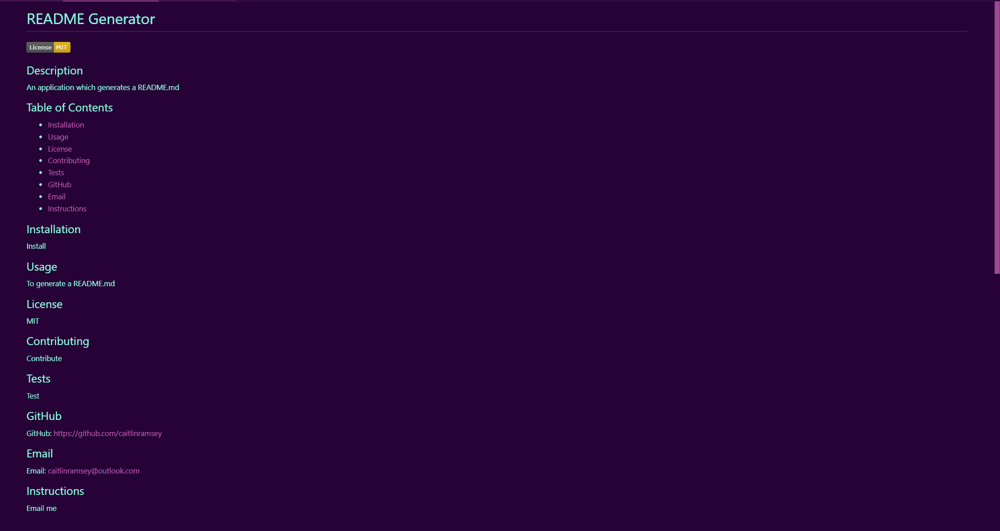

# README Generator

## Description
This application uses JavaScript, Node.js, and inquirer to generate a README.md. Once node index.js is entered into the command line, the user is asked a series of questions. Their answers
to these questions will then be inserted in the proper sections of the generated README file. For the licensing, if a license is chosen, the badge for that license is generated and put into
the README.md. If no license is chosen, nothing will be inserted. This application makes it so that a developer can quickly generate their README document and spend more time focusing on
creating their application.

## GitHub
GitHub: <a href="https://github.com/caitlinramsey/readme-generator" target="_blank">Click Here</a> to view the GitHub repository.

## Walkthrough Video
Video: <a href="https://app.screencastify.com/manage/videos/4TVs9bEY6gBvaVMuQQxR" target="_blank">Click Here</a> to view the walkthrough video.

## Generated README:
